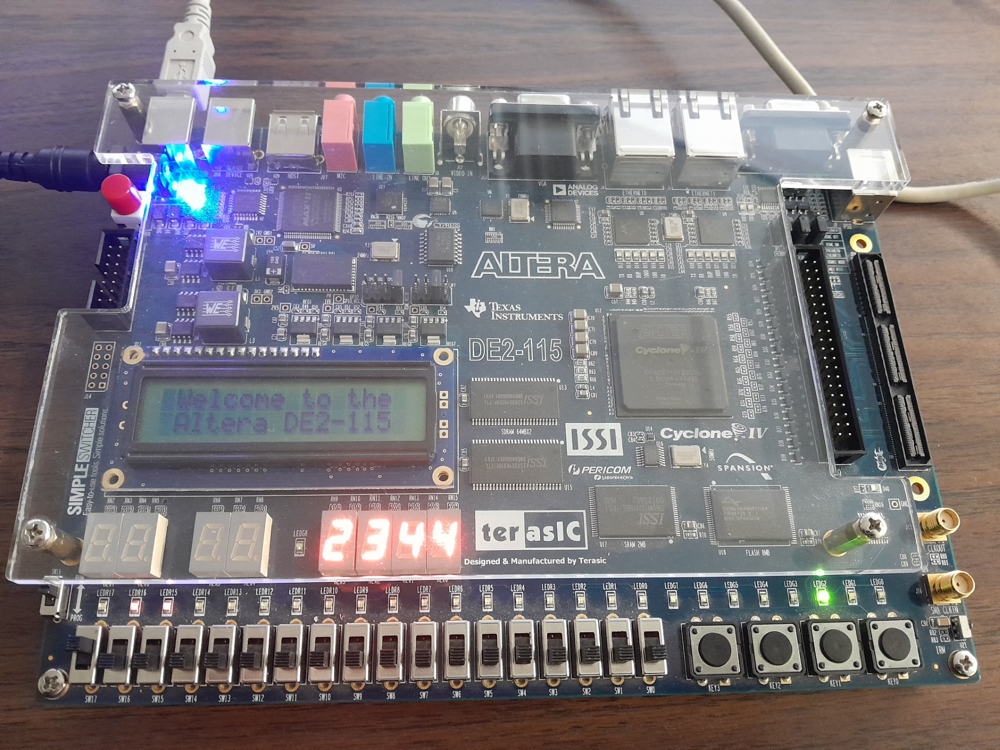

# Modulo 2/3/4/5 Up-Down Counter (VHDL)

A VHDL-based up/down counter designed for FPGA implementation.  
The system performs internal counting in radix 8 and supports displaying values in either base 8 or base 14 using four seven-segment displays. 
The design includes input validation, control switches, and visual indicators for user interaction.

## ✨ Technologies
- VHDL
- FPGA-oriented digital design
- Seven-segment display interfacing

## 🚀 Features
- Up/down counting implemented in VHDL
- Internal counting logic operating in radix 8
- Displays values from 0 up to 2344 (radix 14)
- Switch-controlled radix display (base 8 or base 14)
- Load functionality using 15 binary input switches
- Clear button to reset the counter to zero
- Enable switch to start and stop counting
- Instantiated clock generator module
- Warning signal that prevents loading values greater than 2344 (radix 14)
- Green LEDs indicating the least significant bit of the displayed value
- Four seven-segment displays for visual output

## 🧠 The Process
This project was built to explore modular VHDL design and practical FPGA concepts such as radix-based counting, display conversion, and input validation. 
The design separates internal counting logic from display representation, allowing the same counter value to be viewed in multiple bases without altering 
the core logic. Emphasis was placed on clarity, modularity, and reliable user interaction through hardware switches and indicators.

## 📁 Project Structure
- TopLevel.vhd – Top-level module connecting all components  
- base8Counter.vhd – Core up/down counter logic  
- BaseConverter.vhd – Converts internal values for display in different bases  
- clk_gen_1_output.vhd – Clock generation module  
- sevenSegment.vhd – Seven-segment display driver

## 👀 Preview

- Cyclone IV Altera DE2-115 Development and Education Board
